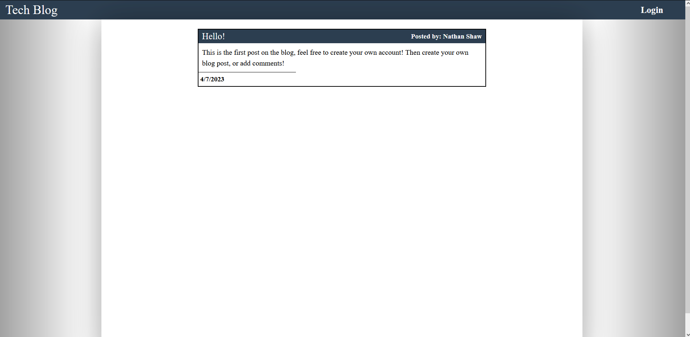

# 14 Model-View-Controller (MVC): Tech Blog

## Deployed Application

[Deployed Tech Blog](https://limitless-harbor-65141.herokuapp.com/)

## Screenshots



## Task

The task was to create a fully functional blog using the Model-View-Controller.
Created a main page with all the posts.
A login functionality that prompts the user to either log in, or create an account.
When the user has either logged in or created their account, then they are taken to the dashboard
which has all the current open blogposts created by the user, or none.
The user will then be given the option to delete or edit a specific post.

The main components here are the server.js that creates the server connection, from there a schema.sql file is used to create the database of techblog_db.
a seed file is added for testing purposes, but for now its no longer necessary.

then sequelize was used to create the models and handle the data in the database to be used in the front end, where handlebars is used to simplify the way the front-end looks like
without having to hardcode a bunch of html, and having to create a bunch of js that will create the html elements.

Partials where used to create each individual blogpost for different parts of the blog, same goes for the form since it was used to create the post, and then to edit the post.

The way the front-end gets its data is from the database, is by doing fetches in the public folder that contains the various javascript files that uses
the following methods: POST, PUT, DELETE.
With those methods, the controllers then activate based on the parameter associated with that method.

## How to use

* Sign-Up:

    * Click on the top right login button on the nav bar.

    * You'll be taken to the login/sign-up page.

    * Add in you name, email, and password.

        * Be aware, must be an email not in use, and password minimum length is 8 characters.
    
    * Click on create account.

    * Take note, the login time will last for 2 and a half minutes, which then you'll be logged out.

* Dashboard:

    * Once your account has been created, you'll be taken to the dashboard.

    * You'll be given the option to create your own blogpost.

    * Add a title for the post and then enter what your post will be. Remember max character limit is 255.

    * Once completed, submit post, where it'll then populate in your dashboard, and in the homepage.

    * With a new post in your account, you'll now have the ability to delete, or edit the post

    * Delete removes the post, but you'll be asked if you're sure you want to, in order to prevent an accidental delete.

    * When you select to Edit, you'll be taken to a new page with a form that has that blog populated, and the ability to edit the post. 

    * Once it's edited, just submit and the updated post will be updated throught the site.

* Main Page:

    * To return to the homepage, click on "Tech-Blog" on the top left corner in the nav bar.

    * If there were no posts prior, the main page will now contain your new post.

    * To begin leaving comments in your post or on other peoples posts, click on the name of the post.

    * You'll be taken a page for that specific post where if you're still logged in, you'll be given the option to add a comment.

    * if you're not logged in, then the ability to add a comment won't be available, and you'll be asked to login.

## User Story

```md
AS A developer who writes about tech
I WANT a CMS-style blog site
SO THAT I can publish articles, blog posts, and my thoughts and opinions
```

## Acceptance Criteria

```md
GIVEN a CMS-style blog site
WHEN I visit the site for the first time
THEN I am presented with the homepage, which includes existing blog posts if any have been posted; navigation links for the homepage and the dashboard; and the option to log in
WHEN I click on the homepage option
THEN I am taken to the homepage
WHEN I click on any other links in the navigation
THEN I am prompted to either sign up or sign in
WHEN I choose to sign up
THEN I am prompted to create a username and password
WHEN I click on the sign-up button
THEN my user credentials are saved and I am logged into the site
WHEN I revisit the site at a later time and choose to sign in
THEN I am prompted to enter my username and password
WHEN I am signed in to the site
THEN I see navigation links for the homepage, the dashboard, and the option to log out
WHEN I click on the homepage option in the navigation
THEN I am taken to the homepage and presented with existing blog posts that include the post title and the date created
WHEN I click on an existing blog post
THEN I am presented with the post title, contents, post creator’s username, and date created for that post and have the option to leave a comment
WHEN I enter a comment and click on the submit button while signed in
THEN the comment is saved and the post is updated to display the comment, the comment creator’s username, and the date created
WHEN I click on the dashboard option in the navigation
THEN I am taken to the dashboard and presented with any blog posts I have already created and the option to add a new blog post
WHEN I click on the button to add a new blog post
THEN I am prompted to enter both a title and contents for my blog post
WHEN I click on the button to create a new blog post
THEN the title and contents of my post are saved and I am taken back to an updated dashboard with my new blog post
WHEN I click on one of my existing posts in the dashboard
THEN I am able to delete or update my post and taken back to an updated dashboard
WHEN I click on the logout option in the navigation
THEN I am signed out of the site
WHEN I am idle on the site for more than a set time
THEN I am able to view comments but I am prompted to log in again before I can add, update, or delete comments
```